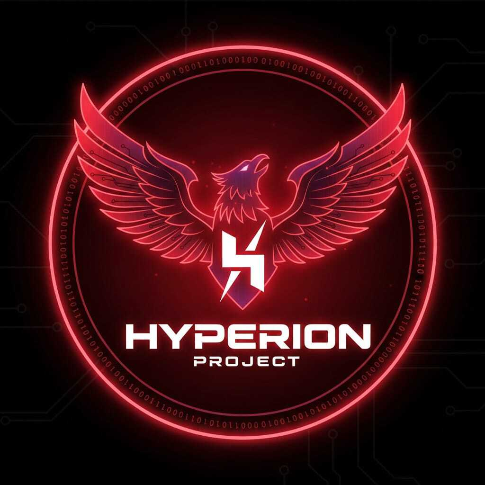
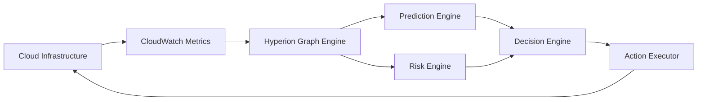

<h1 align="center">🌌 HYPERION — Cognitive Cloud Control System</h1>

<p align="center">
  
</p>

> **Hyperion** is an AI‑driven autonomous cloud infrastructure control system that observes, learns, predicts, and acts on cloud environments in real time.  
It simulates the evolution of next‑generation self‑healing, self‑optimizing cloud platforms.

---

## 🚀 Vision

Modern cloud systems are reactive. Hyperion introduces **cognitive infrastructure** — systems that:
- Observe resource health
- Learn behavioral trends
- Predict failures before they happen
- Calculate risk impact
- Execute safe recovery actions automatically

This project represents a **prototype for autonomous cloud orchestration systems**.

---

## 🧠 System Intelligence Flow



---

## 🏗️ Core Architecture

### 🔹 Graph Engine
Represents infrastructure as a dependency graph of services and compute nodes.

### 🔹 Ingestor
Continuously pulls CPU metrics from AWS CloudWatch.

### 🔹 Prediction Engine
Uses regression to forecast future resource stress.

### 🔹 Risk Engine
Scores impact based on service criticality and dependencies.

### 🔹 Decision Engine
Determines corrective action: NO_ACTION, RESTART, or SAFE_RECOVERY.

### 🔹 Action Executor
Executes safe remediation strategies.

---

## ⚙️ Features

✔ Real-time infrastructure graph modeling  
✔ AI-based CPU prediction  
✔ Risk-aware decision making  
✔ Incident learning memory  
✔ Autonomous remediation simulation  

---

## 📊 Example Output

```
CPU: 75% → STRESSED  
Risk Score: 5  
Decision: SAFE_RECOVERY  
```

---

## 🛠 Tech Stack

- Python  
- AWS EC2 + CloudWatch  
- Graph Modeling  
- Machine Learning  
- Autonomous Systems Logic  

---

## 🔮 Future Scope

- Kubernetes intelligence  
- Multi-metric analysis  
- Reinforcement learning control  
- Web dashboard  

---

## 👨‍💻 Author

**Nitanshu Tak**  
Cloud + AI Engineer  

---

© 2026 Hyperion Cognitive Systems

